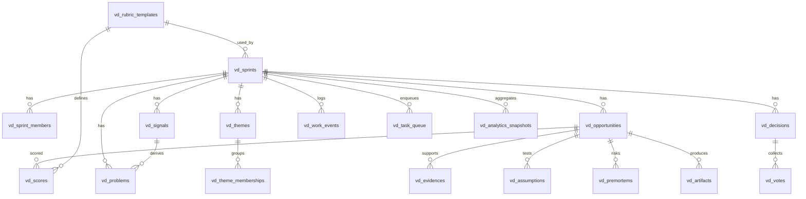

# Discovery-X 통합 기획서 v0.3 (Dev Spec): Venture Discovery Sprint
- 문서 버전: **v0.3 (개발 티켓화 수준)**
- 기준 문서: `Venture_Discovery_Sprint_PRD_v0.2.md`
- 작성일: 2026-02-03
- 목적: v0.2 PRD를 **바로 개발 티켓으로 분해 가능한 스펙**으로 구체화  
  (ERD 수준 테이블 정의, Drizzle 스키마 초안, 라우트별 loader/action I/O, 워커 task enum/리트라이 정책)

---

## 0) 스코프/결정 사항(재확인)
- 통합 방식: **Discovery-X에 합치되**, `/venture/*`를 **sub-app**처럼 분리
- 데이터 경계: Venture 전용 테이블 prefix `vd_*`로 논리 분리
- 워커 경계: 웹앱과 분리된 전용 워커(예: `venture-worker/`)가 `vd_task_queue` 소비
- 민감도: 고객명/예산/조달/경쟁사 등 고민감 정보 유입 가능성 **낮음**  
  → **물리 분리(별도 사이트/별도 DB)** 대신 논리 분리 + ACL + 감사로그로 대응

---

# 1) 개발 티켓 분해(에픽/티켓 템플릿)

## Epic A — `/venture/*` Sub-app 라우팅/화면 뼈대
### A1. Venture 섹션 네비 추가 + 라우팅 스캐폴딩
- 산출물
  - `/venture/overview`
  - `/venture/sprints`
  - `/venture/sprints/new`
  - `/venture/sprints/:sprintId/*` 레이아웃
- 완료 기준(AC)
  - 메뉴에서 Venture 진입 가능
  - 모든 라우트가 200 응답(더미 데이터로도 OK)
  - sprintId 레이아웃에서 하위 탭 이동 가능

### A2. 공통 UI 컴포넌트(venture 전용)
- `VentureShell`, `DecisionCard`, `OpportunityCard`, `ClusterList`, `ScoreSheet`, `AnalyticsWidgets`
- AC: 최소 2개 화면에서 공통 컴포넌트 재사용

---

## Epic B — DB(ERD) + Drizzle 스키마 + 마이그레이션
### B1. `vd_*` 테이블 생성(핵심 엔터티 + 인덱스)
- 테이블: `vd_sprints`, `vd_sprint_members`, `vd_signals`, `vd_problems`, `vd_themes`, `vd_theme_memberships`, `vd_opportunities`, `vd_evidences`, `vd_assumptions`, `vd_premortems`, `vd_artifacts`
- AC: `pnpm drizzle:generate`/`pnpm drizzle:migrate` 등 프로젝트 표준 절차로 적용 가능(명령은 레포 설정에 맞춤)

### B2. HITL 테이블 생성
- `vd_decisions`, `vd_votes`, `vd_scores`, `vd_rubric_templates`
- AC: Decision 생성/투표/집계 쿼리 가능

### B3. 워커/분석 테이블 생성
- `vd_task_queue`, `vd_work_events`, `vd_analytics_snapshots`
- AC: task claim 쿼리 성능(인덱스) 확보

---

## Epic C — Venture 서비스 레이어(Usecase/API) + Work Event 로깅
### C1. Sprint 생성/조회/상태전이 서비스
- `createSprint()`, `getSprint()`, `transitionSprintStatus()`
- AC: 상태 머신 정책 위반 시 400(또는 도메인 에러)로 차단

### C2. Inbox/Longlist CRUD 서비스
- Signal/Evidence/Opportunity/Theme/Tagging
- AC: 모든 변경이 `vd_work_events`에 기록

### C3. Decision Center 서비스
- `proposeDecisionByAgent()`, `submitVote()`, `computeDecisionResult()`, `approveDecision()`
- AC: 블라인드 투표/재투표 플로우 지원

---

## Epic D — 내부 API(워커 ↔ 웹앱) 최소 세트
### D1. Task Claim/Report API
- `POST /venture/api/tasks/claim`
- `POST /venture/api/tasks/report`
- AC: venture-worker에서 호출 시 정상 claim/complete 가능

### D2. Analytics Recompute API
- `POST /venture/api/analytics/recompute`
- AC: recompute 후 snapshot 생성

---

## Epic E — venture-worker (Agent/Analytics)
### E1. 워커 스캐폴딩 + D1 접근
- 폴더: `venture-worker/` (레포의 `radar-worker/` 패턴 참고)
- AC: 로컬/스테이징에서 task claim/execute/report 단순 루프 동작

### E2. Task 타입별 실행기 구현(MVP)
- 우선순위: `COMPUTE_ANALYTICS_SNAPSHOT`, `PREPARE_GATE1_DECISION`, `PREPARE_GATE2_DECISION`, `GENERATE_DEEPDIVE_PACK`, `GENERATE_PACKAGING`
- AC: 각 task가 DB에 결과(Decision/Artifact/Snapshot) 저장

### E3. Retry/Backoff/Idempotency
- AC: LLM 일시 오류 시 재시도, 스키마 오류 시 제한 재시도, 치명 오류는 즉시 실패

---

## Epic F — Analytics UI(Depth/Effort/Next-ROI)
### F1. Analytics v0 (퍼널/도메인 분포/이벤트 기반 Effort)
- AC: sprint analytics 화면에서 위젯 3개 이상 표시

### F2. Depth Score + ROI 추천
- AC: INVEST/EXPLORE/HOLD/DROP 추천 리스트 생성

---

# 2) ERD (Mermaid) + 테이블 정의(ERD 수준)

## 2.1 ERD (Mermaid)


> 사용자 테이블(예: `users`)은 기존 Discovery-X 인증/유저 모델을 사용한다고 가정한다.  
> 본 ERD는 `vd_*` 범위만 다룬다.

---

## 2.2 공통 컬럼/컨벤션(권장)
- `id`: `TEXT` (UUID, `crypto.randomUUID()`로 생성)
- `created_at`, `updated_at`: `INTEGER` (epoch milliseconds)
- JSON: SQLite에서는 `TEXT`로 저장(`JSON.stringify`) + 앱 레벨에서 `Zod`로 검증
- actor:
  - `actor_type`: `'user' | 'agent'`
  - `actor_id`: userId 또는 agentId 문자열

---

## 2.3 테이블 상세 정의

### 2.3.1 `vd_sprints`
| 컬럼 | 타입 | 제약 | 설명 |
|---|---|---|---|
| id | TEXT | PK | 스프린트 ID |
| name | TEXT | NOT NULL | 스프린트 이름 |
| status | TEXT | NOT NULL | `DRAFT/RUNNING/GATE1_PENDING/DEEPDIVE/GATE2_PENDING/PACKAGING/COMPLETED/ARCHIVED` |
| template_key | TEXT | NOT NULL | 예: `BOOTCAMP_5D` |
| owner_user_id | TEXT | NOT NULL | 스프린트 오너(기존 users.id) |
| rubric_template_id | TEXT | NULL | `vd_rubric_templates.id` |
| start_at | INTEGER | NULL | 시작(계획) |
| end_at | INTEGER | NULL | 종료(계획) |
| created_at | INTEGER | NOT NULL |  |
| updated_at | INTEGER | NOT NULL |  |

**Indexes**
- `idx_vd_sprints_status(status)`
- `idx_vd_sprints_owner(owner_user_id)`

---

### 2.3.2 `vd_sprint_members`
| 컬럼 | 타입 | 제약 | 설명 |
|---|---|---|---|
| id | TEXT | PK |  |
| sprint_id | TEXT | NOT NULL | FK → `vd_sprints.id` |
| user_id | TEXT | NOT NULL | FK → `users.id`(가정) |
| role | TEXT | NOT NULL | `OWNER/CONTRIBUTOR/REVIEWER` |
| created_at | INTEGER | NOT NULL |  |

**Constraints**
- Unique: `(sprint_id, user_id)`

**Indexes**
- `idx_vd_members_sprint(sprint_id)`

---

### 2.3.3 `vd_signals`
| 컬럼 | 타입 | 제약 | 설명 |
|---|---|---|---|
| id | TEXT | PK |  |
| sprint_id | TEXT | NOT NULL | FK → `vd_sprints.id` |
| title | TEXT | NOT NULL | 신호 한 줄 |
| summary | TEXT | NULL | 요약/해석 |
| source_url | TEXT | NULL | 링크 |
| source_type | TEXT | NULL | `article/report/internal/observation/...` |
| actor_type | TEXT | NOT NULL | `user/agent` |
| actor_id | TEXT | NOT NULL |  |
| created_at | INTEGER | NOT NULL |  |
| updated_at | INTEGER | NOT NULL |  |

**Indexes**
- `idx_vd_signals_sprint(sprint_id)`
- `idx_vd_signals_created(created_at)`

---

### 2.3.4 `vd_problems`
| 컬럼 | 타입 | 제약 | 설명 |
|---|---|---|---|
| id | TEXT | PK |  |
| sprint_id | TEXT | NOT NULL | FK |
| signal_id | TEXT | NULL | FK → `vd_signals.id` |
| statement | TEXT | NOT NULL | 문제 문장(누가/무엇/왜/얼마나) |
| persona | TEXT | NULL | 타깃 페르소나 |
| impact | TEXT | NULL | 영향/고통 |
| actor_type | TEXT | NOT NULL |  |
| actor_id | TEXT | NOT NULL |  |
| created_at | INTEGER | NOT NULL |  |
| updated_at | INTEGER | NOT NULL |  |

**Indexes**
- `idx_vd_problems_sprint(sprint_id)`
- `idx_vd_problems_signal(signal_id)`

---

### 2.3.5 `vd_themes` (토픽/클러스터)
| 컬럼 | 타입 | 제약 | 설명 |
|---|---|---|---|
| id | TEXT | PK |  |
| sprint_id | TEXT | NOT NULL | FK |
| name | TEXT | NOT NULL | 클러스터 라벨 |
| summary | TEXT | NULL | 클러스터 설명 |
| created_by_agent | INTEGER | NOT NULL | 0/1 |
| created_at | INTEGER | NOT NULL |  |
| updated_at | INTEGER | NOT NULL |  |

**Indexes**
- `idx_vd_themes_sprint(sprint_id)`

---

### 2.3.6 `vd_theme_memberships` (엔터티-클러스터 소속)
| 컬럼 | 타입 | 제약 | 설명 |
|---|---|---|---|
| id | TEXT | PK |  |
| sprint_id | TEXT | NOT NULL | FK |
| theme_id | TEXT | NOT NULL | FK → `vd_themes.id` |
| entity_type | TEXT | NOT NULL | `signal/problem/opportunity` |
| entity_id | TEXT | NOT NULL | 각 엔터티 id |
| weight | REAL | NULL | 유사도/가중치(옵션) |
| created_by_agent | INTEGER | NOT NULL | 0/1 |
| created_at | INTEGER | NOT NULL |  |

**Constraints**
- Unique: `(theme_id, entity_type, entity_id)`

**Indexes**
- `idx_vd_theme_membership_entity(sprint_id, entity_type, entity_id)`
- `idx_vd_theme_membership_theme(theme_id)`

---

### 2.3.7 `vd_opportunities`
| 컬럼 | 타입 | 제약 | 설명 |
|---|---|---|---|
| id | TEXT | PK |  |
| sprint_id | TEXT | NOT NULL | FK |
| theme_id | TEXT | NULL | FK → `vd_themes.id` |
| problem_id | TEXT | NULL | FK → `vd_problems.id` |
| title | TEXT | NOT NULL | 카드명 |
| buyer | TEXT | NULL | 구매주체/부서 |
| budget_hint | TEXT | NULL | 예산 가설 |
| solution_one_liner | TEXT | NULL | 솔루션 1줄 |
| differentiation_json | TEXT | NULL | 차별점(배열/객체 JSON) |
| risks_json | TEXT | NULL | 반대근거/리스크 JSON |
| expected_impact_json | TEXT | NULL | 효과 가설 JSON |
| status | TEXT | NOT NULL | `DRAFT/SHORTLISTED/FINAL/HOLD/DROPPED` |
| tags_json | TEXT | NULL | 태그(JSON: industry/function/tech/value_chain) |
| actor_type | TEXT | NOT NULL | 생성/주 편집 주체 |
| actor_id | TEXT | NOT NULL |  |
| created_at | INTEGER | NOT NULL |  |
| updated_at | INTEGER | NOT NULL |  |

**Indexes**
- `idx_vd_opp_sprint(sprint_id)`
- `idx_vd_opp_status(sprint_id, status)`
- `idx_vd_opp_theme(theme_id)`

> `tags_json`는 MVP에서 빠른 구현을 위한 단순 구조.  
> 고도화 시 `vd_tags/vd_entity_tags` 테이블로 정규화 가능(Phase 2/3).

---

### 2.3.8 `vd_evidences`
| 컬럼 | 타입 | 제약 | 설명 |
|---|---|---|---|
| id | TEXT | PK |  |
| sprint_id | TEXT | NOT NULL | FK |
| opportunity_id | TEXT | NULL | FK |
| type | TEXT | NOT NULL | `url/note/file` |
| url | TEXT | NULL |  |
| title | TEXT | NULL |  |
| excerpt | TEXT | NULL | 발췌 |
| summary | TEXT | NULL | 요약 |
| credibility_score | INTEGER | NULL | 0~100 |
| actor_type | TEXT | NOT NULL |  |
| actor_id | TEXT | NOT NULL |  |
| created_at | INTEGER | NOT NULL |  |

**Indexes**
- `idx_vd_evidence_opp(opportunity_id)`
- `idx_vd_evidence_sprint(sprint_id)`

---

### 2.3.9 `vd_assumptions`
| 컬럼 | 타입 | 제약 | 설명 |
|---|---|---|---|
| id | TEXT | PK |  |
| sprint_id | TEXT | NOT NULL | FK |
| opportunity_id | TEXT | NOT NULL | FK |
| category | TEXT | NOT NULL | `market/tech/data/buyer/ops` |
| assumption | TEXT | NOT NULL | 가정 문장 |
| validation_plan | TEXT | NULL | 검증 계획 |
| status | TEXT | NOT NULL | `unknown/validated/invalid` |
| actor_type | TEXT | NOT NULL |  |
| actor_id | TEXT | NOT NULL |  |
| created_at | INTEGER | NOT NULL |  |
| updated_at | INTEGER | NOT NULL |  |

**Indexes**
- `idx_vd_assumption_opp(opportunity_id)`

---

### 2.3.10 `vd_premortems`
| 컬럼 | 타입 | 제약 | 설명 |
|---|---|---|---|
| id | TEXT | PK |  |
| sprint_id | TEXT | NOT NULL | FK |
| opportunity_id | TEXT | NOT NULL | FK |
| category | TEXT | NULL | `regulation/security/data/exec/...` |
| failure_scenario | TEXT | NOT NULL | 실패 시나리오 |
| mitigation | TEXT | NULL | 완화책 |
| actor_type | TEXT | NOT NULL |  |
| actor_id | TEXT | NOT NULL |  |
| created_at | INTEGER | NOT NULL |  |
| updated_at | INTEGER | NOT NULL |  |

**Indexes**
- `idx_vd_premortem_opp(opportunity_id)`

---

### 2.3.11 `vd_artifacts`
| 컬럼 | 타입 | 제약 | 설명 |
|---|---|---|---|
| id | TEXT | PK |  |
| sprint_id | TEXT | NOT NULL | FK |
| opportunity_id | TEXT | NULL | FK(공통 산출물은 NULL) |
| type | TEXT | NOT NULL | `lean_canvas/summary_doc/pitch_outline/qa_pack/...` |
| version | INTEGER | NOT NULL | 1..n |
| content_md | TEXT | NOT NULL | Markdown |
| created_by_agent | INTEGER | NOT NULL | 0/1 |
| created_at | INTEGER | NOT NULL |  |
| updated_at | INTEGER | NOT NULL |  |

**Constraints**
- Unique: `(sprint_id, opportunity_id, type, version)`

**Indexes**
- `idx_vd_artifact_opp(opportunity_id)`
- `idx_vd_artifact_sprint(sprint_id, type)`

---

### 2.3.12 `vd_rubric_templates`
| 컬럼 | 타입 | 제약 | 설명 |
|---|---|---|---|
| id | TEXT | PK |  |
| key | TEXT | NOT NULL | 예: `TECH_LEADERSHIP_BRANDING_V1` |
| name | TEXT | NOT NULL | 표시명 |
| weights_json | TEXT | NOT NULL | 기준/가중치 JSON |
| kill_criteria_json | TEXT | NULL | Kill criteria JSON |
| created_at | INTEGER | NOT NULL |  |
| updated_at | INTEGER | NOT NULL |  |

**Constraints**
- Unique: `(key)`

---

### 2.3.13 `vd_scores`
| 컬럼 | 타입 | 제약 | 설명 |
|---|---|---|---|
| id | TEXT | PK |  |
| sprint_id | TEXT | NOT NULL | FK |
| gate | INTEGER | NOT NULL | 1 or 2 |
| opportunity_id | TEXT | NOT NULL | FK |
| user_id | TEXT | NOT NULL | FK(users) |
| rubric_template_id | TEXT | NOT NULL | FK → `vd_rubric_templates.id` |
| rubric_scores_json | TEXT | NOT NULL | 기준별 점수 JSON |
| total_score | INTEGER | NOT NULL | 합산(서버 계산) |
| created_at | INTEGER | NOT NULL |  |

**Constraints**
- Unique: `(gate, opportunity_id, user_id)`

**Indexes**
- `idx_vd_scores_sprint(gate, sprint_id)`
- `idx_vd_scores_opp(opportunity_id)`

---

### 2.3.14 `vd_decisions`
| 컬럼 | 타입 | 제약 | 설명 |
|---|---|---|---|
| id | TEXT | PK |  |
| sprint_id | TEXT | NOT NULL | FK |
| type | TEXT | NOT NULL | `SCOPE_SELECT/GATE1_SHORTLIST/GATE2_FINAL/PUBLISH_APPROVE` |
| title | TEXT | NOT NULL |  |
| status | TEXT | NOT NULL | `pending/approved/rejected/expired` |
| options_json | TEXT | NOT NULL | 옵션 목록(JSON) |
| recommended_option | TEXT | NULL | 추천 옵션 key |
| rationale_md | TEXT | NULL | 근거 |
| risk_flags_json | TEXT | NULL | 리스크 플래그 |
| blind | INTEGER | NOT NULL | 블라인드 여부 |
| due_at | INTEGER | NULL | 마감 |
| created_at | INTEGER | NOT NULL |  |
| updated_at | INTEGER | NOT NULL |  |
| decided_at | INTEGER | NULL |  |
| decided_by_user_id | TEXT | NULL |  |

**Indexes**
- `idx_vd_decisions_sprint(sprint_id, status)`
- `idx_vd_decisions_type(sprint_id, type)`

---

### 2.3.15 `vd_votes`
| 컬럼 | 타입 | 제약 | 설명 |
|---|---|---|---|
| id | TEXT | PK |  |
| decision_id | TEXT | NOT NULL | FK → `vd_decisions.id` |
| user_id | TEXT | NOT NULL | FK(users) |
| vote_value | TEXT | NOT NULL | 옵션 key |
| comment | TEXT | NULL |  |
| created_at | INTEGER | NOT NULL |  |

**Constraints**
- Unique: `(decision_id, user_id)`

**Indexes**
- `idx_vd_votes_decision(decision_id)`

---

### 2.3.16 `vd_work_events`
| 컬럼 | 타입 | 제약 | 설명 |
|---|---|---|---|
| id | TEXT | PK |  |
| sprint_id | TEXT | NOT NULL | FK |
| actor_type | TEXT | NOT NULL | `user/agent` |
| actor_id | TEXT | NOT NULL |  |
| entity_type | TEXT | NOT NULL | `sprint/signal/problem/theme/opportunity/decision/artifact/evidence/...` |
| entity_id | TEXT | NOT NULL |  |
| action_type | TEXT | NOT NULL | `create/update/comment/vote/approve/...` |
| metadata_json | TEXT | NULL | 부가정보 |
| created_at | INTEGER | NOT NULL |  |

**Indexes**
- `idx_vd_events_sprint_time(sprint_id, created_at)`
- `idx_vd_events_entity(entity_type, entity_id)`

---

### 2.3.17 `vd_task_queue`
| 컬럼 | 타입 | 제약 | 설명 |
|---|---|---|---|
| id | TEXT | PK |  |
| sprint_id | TEXT | NOT NULL | FK |
| type | TEXT | NOT NULL | Task enum |
| payload_json | TEXT | NOT NULL | 입력 |
| status | TEXT | NOT NULL | `queued/claimed/succeeded/failed/cancelled` |
| priority | INTEGER | NOT NULL | 기본 100(낮을수록 우선) |
| scheduled_at | INTEGER | NOT NULL | 실행 예정 |
| claimed_by | TEXT | NULL | worker id |
| claimed_at | INTEGER | NULL |  |
| attempt | INTEGER | NOT NULL | 기본 0 |
| max_attempts | INTEGER | NOT NULL | 기본 6 |
| last_error_json | TEXT | NULL |  |
| dedupe_key | TEXT | NULL | idem key |
| created_at | INTEGER | NOT NULL |  |
| updated_at | INTEGER | NOT NULL |  |

**Indexes**
- `idx_vd_tasks_claim(status, scheduled_at, priority)`
- `idx_vd_tasks_sprint(sprint_id, status)`

**Constraints**
- Optional Unique: `(sprint_id, type, dedupe_key)` (dedupe_key가 있을 때)

---

### 2.3.18 `vd_analytics_snapshots`
| 컬럼 | 타입 | 제약 | 설명 |
|---|---|---|---|
| id | TEXT | PK |  |
| sprint_id | TEXT | NULL | 스프린트별이면 값, 전체면 NULL |
| computed_at | INTEGER | NOT NULL |  |
| funnel_json | TEXT | NOT NULL | 퍼널 통계 |
| domain_stats_json | TEXT | NOT NULL | 도메인 분포/Depth/Effort |
| cluster_stats_json | TEXT | NOT NULL | 클러스터 통계 |
| recommendations_json | TEXT | NOT NULL | Invest/Hold/Drop/Explore |
| metrics_json | TEXT | NULL | 기타 |
| created_at | INTEGER | NOT NULL |  |

**Indexes**
- `idx_vd_snapshot_sprint(sprint_id, computed_at)`

---

# 3) Drizzle 스키마 초안(TypeScript)

> 파일 경로 제안(레포 컨벤션에 맞춰 조정):
- `drizzle/schema.vd.ts` (venture 전용 테이블)
- 또는 기존 `drizzle/schema.ts`가 있다면 해당 파일에 `vd_*` 추가

> 주의: 아래 코드는 “초안”이며 레포의 기존 db bootstrap/exports 방식에 맞춰 import/export를 맞춰야 한다.

```ts
// drizzle/schema.vd.ts
import { sqliteTable, text, integer, real, index, uniqueIndex } from "drizzle-orm/sqlite-core";

const nowMs = () => Date.now();

/**
 * Helpers
 * - timestamps: epoch ms integer
 * - booleans: 0/1 integer
 */

export const vdSprints = sqliteTable(
  "vd_sprints",
  {
    id: text("id").primaryKey(),
    name: text("name").notNull(),
    status: text("status").notNull(),
    templateKey: text("template_key").notNull(),
    ownerUserId: text("owner_user_id").notNull(),
    rubricTemplateId: text("rubric_template_id"),
    startAt: integer("start_at"),
    endAt: integer("end_at"),
    createdAt: integer("created_at").notNull(),
    updatedAt: integer("updated_at").notNull(),
  },
  (t) => ({
    idxStatus: index("idx_vd_sprints_status").on(t.status),
    idxOwner: index("idx_vd_sprints_owner").on(t.ownerUserId),
  })
);

export const vdSprintMembers = sqliteTable(
  "vd_sprint_members",
  {
    id: text("id").primaryKey(),
    sprintId: text("sprint_id").notNull(),
    userId: text("user_id").notNull(),
    role: text("role").notNull(), // OWNER/CONTRIBUTOR/REVIEWER
    createdAt: integer("created_at").notNull(),
  },
  (t) => ({
    uqSprintUser: uniqueIndex("uq_vd_members_sprint_user").on(t.sprintId, t.userId),
    idxSprint: index("idx_vd_members_sprint").on(t.sprintId),
  })
);

export const vdSignals = sqliteTable(
  "vd_signals",
  {
    id: text("id").primaryKey(),
    sprintId: text("sprint_id").notNull(),
    title: text("title").notNull(),
    summary: text("summary"),
    sourceUrl: text("source_url"),
    sourceType: text("source_type"),
    actorType: text("actor_type").notNull(), // user/agent
    actorId: text("actor_id").notNull(),
    createdAt: integer("created_at").notNull(),
    updatedAt: integer("updated_at").notNull(),
  },
  (t) => ({
    idxSprint: index("idx_vd_signals_sprint").on(t.sprintId),
    idxCreated: index("idx_vd_signals_created").on(t.createdAt),
  })
);

export const vdProblems = sqliteTable(
  "vd_problems",
  {
    id: text("id").primaryKey(),
    sprintId: text("sprint_id").notNull(),
    signalId: text("signal_id"),
    statement: text("statement").notNull(),
    persona: text("persona"),
    impact: text("impact"),
    actorType: text("actor_type").notNull(),
    actorId: text("actor_id").notNull(),
    createdAt: integer("created_at").notNull(),
    updatedAt: integer("updated_at").notNull(),
  },
  (t) => ({
    idxSprint: index("idx_vd_problems_sprint").on(t.sprintId),
    idxSignal: index("idx_vd_problems_signal").on(t.signalId),
  })
);

export const vdThemes = sqliteTable(
  "vd_themes",
  {
    id: text("id").primaryKey(),
    sprintId: text("sprint_id").notNull(),
    name: text("name").notNull(),
    summary: text("summary"),
    createdByAgent: integer("created_by_agent").notNull(), // 0/1
    createdAt: integer("created_at").notNull(),
    updatedAt: integer("updated_at").notNull(),
  },
  (t) => ({
    idxSprint: index("idx_vd_themes_sprint").on(t.sprintId),
  })
);

export const vdThemeMemberships = sqliteTable(
  "vd_theme_memberships",
  {
    id: text("id").primaryKey(),
    sprintId: text("sprint_id").notNull(),
    themeId: text("theme_id").notNull(),
    entityType: text("entity_type").notNull(), // signal/problem/opportunity
    entityId: text("entity_id").notNull(),
    weight: real("weight"),
    createdByAgent: integer("created_by_agent").notNull(),
    createdAt: integer("created_at").notNull(),
  },
  (t) => ({
    uqThemeEntity: uniqueIndex("uq_vd_theme_entity").on(t.themeId, t.entityType, t.entityId),
    idxEntity: index("idx_vd_theme_membership_entity").on(t.sprintId, t.entityType, t.entityId),
    idxTheme: index("idx_vd_theme_membership_theme").on(t.themeId),
  })
);

export const vdOpportunities = sqliteTable(
  "vd_opportunities",
  {
    id: text("id").primaryKey(),
    sprintId: text("sprint_id").notNull(),
    themeId: text("theme_id"),
    problemId: text("problem_id"),
    title: text("title").notNull(),
    buyer: text("buyer"),
    budgetHint: text("budget_hint"),
    solutionOneLiner: text("solution_one_liner"),
    differentiationJson: text("differentiation_json"),
    risksJson: text("risks_json"),
    expectedImpactJson: text("expected_impact_json"),
    status: text("status").notNull(), // DRAFT/SHORTLISTED/FINAL/HOLD/DROPPED
    tagsJson: text("tags_json"),
    actorType: text("actor_type").notNull(),
    actorId: text("actor_id").notNull(),
    createdAt: integer("created_at").notNull(),
    updatedAt: integer("updated_at").notNull(),
  },
  (t) => ({
    idxSprint: index("idx_vd_opp_sprint").on(t.sprintId),
    idxStatus: index("idx_vd_opp_status").on(t.sprintId, t.status),
    idxTheme: index("idx_vd_opp_theme").on(t.themeId),
  })
);

export const vdEvidences = sqliteTable(
  "vd_evidences",
  {
    id: text("id").primaryKey(),
    sprintId: text("sprint_id").notNull(),
    opportunityId: text("opportunity_id"),
    type: text("type").notNull(), // url/note/file
    url: text("url"),
    title: text("title"),
    excerpt: text("excerpt"),
    summary: text("summary"),
    credibilityScore: integer("credibility_score"),
    actorType: text("actor_type").notNull(),
    actorId: text("actor_id").notNull(),
    createdAt: integer("created_at").notNull(),
  },
  (t) => ({
    idxOpp: index("idx_vd_evidence_opp").on(t.opportunityId),
    idxSprint: index("idx_vd_evidence_sprint").on(t.sprintId),
  })
);

export const vdAssumptions = sqliteTable(
  "vd_assumptions",
  {
    id: text("id").primaryKey(),
    sprintId: text("sprint_id").notNull(),
    opportunityId: text("opportunity_id").notNull(),
    category: text("category").notNull(), // market/tech/data/buyer/ops
    assumption: text("assumption").notNull(),
    validationPlan: text("validation_plan"),
    status: text("status").notNull(), // unknown/validated/invalid
    actorType: text("actor_type").notNull(),
    actorId: text("actor_id").notNull(),
    createdAt: integer("created_at").notNull(),
    updatedAt: integer("updated_at").notNull(),
  },
  (t) => ({
    idxOpp: index("idx_vd_assumption_opp").on(t.opportunityId),
  })
);

export const vdPremortems = sqliteTable(
  "vd_premortems",
  {
    id: text("id").primaryKey(),
    sprintId: text("sprint_id").notNull(),
    opportunityId: text("opportunity_id").notNull(),
    category: text("category"),
    failureScenario: text("failure_scenario").notNull(),
    mitigation: text("mitigation"),
    actorType: text("actor_type").notNull(),
    actorId: text("actor_id").notNull(),
    createdAt: integer("created_at").notNull(),
    updatedAt: integer("updated_at").notNull(),
  },
  (t) => ({
    idxOpp: index("idx_vd_premortem_opp").on(t.opportunityId),
  })
);

export const vdArtifacts = sqliteTable(
  "vd_artifacts",
  {
    id: text("id").primaryKey(),
    sprintId: text("sprint_id").notNull(),
    opportunityId: text("opportunity_id"),
    type: text("type").notNull(),
    version: integer("version").notNull(),
    contentMd: text("content_md").notNull(),
    createdByAgent: integer("created_by_agent").notNull(),
    createdAt: integer("created_at").notNull(),
    updatedAt: integer("updated_at").notNull(),
  },
  (t) => ({
    uqArtifact: uniqueIndex("uq_vd_artifact_unique").on(t.sprintId, t.opportunityId, t.type, t.version),
    idxOpp: index("idx_vd_artifact_opp").on(t.opportunityId),
    idxSprintType: index("idx_vd_artifact_sprint_type").on(t.sprintId, t.type),
  })
);

export const vdRubricTemplates = sqliteTable(
  "vd_rubric_templates",
  {
    id: text("id").primaryKey(),
    key: text("key").notNull(),
    name: text("name").notNull(),
    weightsJson: text("weights_json").notNull(),
    killCriteriaJson: text("kill_criteria_json"),
    createdAt: integer("created_at").notNull(),
    updatedAt: integer("updated_at").notNull(),
  },
  (t) => ({
    uqKey: uniqueIndex("uq_vd_rubric_key").on(t.key),
  })
);

export const vdScores = sqliteTable(
  "vd_scores",
  {
    id: text("id").primaryKey(),
    sprintId: text("sprint_id").notNull(),
    gate: integer("gate").notNull(),
    opportunityId: text("opportunity_id").notNull(),
    userId: text("user_id").notNull(),
    rubricTemplateId: text("rubric_template_id").notNull(),
    rubricScoresJson: text("rubric_scores_json").notNull(),
    totalScore: integer("total_score").notNull(),
    createdAt: integer("created_at").notNull(),
  },
  (t) => ({
    uqGateOppUser: uniqueIndex("uq_vd_scores_gate_opp_user").on(t.gate, t.opportunityId, t.userId),
    idxSprintGate: index("idx_vd_scores_sprint_gate").on(t.gate, t.sprintId),
    idxOpp: index("idx_vd_scores_opp").on(t.opportunityId),
  })
);

export const vdDecisions = sqliteTable(
  "vd_decisions",
  {
    id: text("id").primaryKey(),
    sprintId: text("sprint_id").notNull(),
    type: text("type").notNull(),
    title: text("title").notNull(),
    status: text("status").notNull(),
    optionsJson: text("options_json").notNull(),
    recommendedOption: text("recommended_option"),
    rationaleMd: text("rationale_md"),
    riskFlagsJson: text("risk_flags_json"),
    blind: integer("blind").notNull(),
    dueAt: integer("due_at"),
    createdAt: integer("created_at").notNull(),
    updatedAt: integer("updated_at").notNull(),
    decidedAt: integer("decided_at"),
    decidedByUserId: text("decided_by_user_id"),
  },
  (t) => ({
    idxSprintStatus: index("idx_vd_decisions_sprint_status").on(t.sprintId, t.status),
    idxSprintType: index("idx_vd_decisions_sprint_type").on(t.sprintId, t.type),
  })
);

export const vdVotes = sqliteTable(
  "vd_votes",
  {
    id: text("id").primaryKey(),
    decisionId: text("decision_id").notNull(),
    userId: text("user_id").notNull(),
    voteValue: text("vote_value").notNull(),
    comment: text("comment"),
    createdAt: integer("created_at").notNull(),
  },
  (t) => ({
    uqDecisionUser: uniqueIndex("uq_vd_votes_decision_user").on(t.decisionId, t.userId),
    idxDecision: index("idx_vd_votes_decision").on(t.decisionId),
  })
);

export const vdWorkEvents = sqliteTable(
  "vd_work_events",
  {
    id: text("id").primaryKey(),
    sprintId: text("sprint_id").notNull(),
    actorType: text("actor_type").notNull(),
    actorId: text("actor_id").notNull(),
    entityType: text("entity_type").notNull(),
    entityId: text("entity_id").notNull(),
    actionType: text("action_type").notNull(),
    metadataJson: text("metadata_json"),
    createdAt: integer("created_at").notNull(),
  },
  (t) => ({
    idxSprintTime: index("idx_vd_events_sprint_time").on(t.sprintId, t.createdAt),
    idxEntity: index("idx_vd_events_entity").on(t.entityType, t.entityId),
  })
);

export const vdTaskQueue = sqliteTable(
  "vd_task_queue",
  {
    id: text("id").primaryKey(),
    sprintId: text("sprint_id").notNull(),
    type: text("type").notNull(),
    payloadJson: text("payload_json").notNull(),
    status: text("status").notNull(),
    priority: integer("priority").notNull(),
    scheduledAt: integer("scheduled_at").notNull(),
    claimedBy: text("claimed_by"),
    claimedAt: integer("claimed_at"),
    attempt: integer("attempt").notNull(),
    maxAttempts: integer("max_attempts").notNull(),
    lastErrorJson: text("last_error_json"),
    dedupeKey: text("dedupe_key"),
    createdAt: integer("created_at").notNull(),
    updatedAt: integer("updated_at").notNull(),
  },
  (t) => ({
    idxClaim: index("idx_vd_tasks_claim").on(t.status, t.scheduledAt, t.priority),
    idxSprintStatus: index("idx_vd_tasks_sprint_status").on(t.sprintId, t.status),
    // optional: uniqueIndex("uq_vd_tasks_dedupe").on(t.sprintId, t.type, t.dedupeKey),
  })
);

export const vdAnalyticsSnapshots = sqliteTable(
  "vd_analytics_snapshots",
  {
    id: text("id").primaryKey(),
    sprintId: text("sprint_id"),
    computedAt: integer("computed_at").notNull(),
    funnelJson: text("funnel_json").notNull(),
    domainStatsJson: text("domain_stats_json").notNull(),
    clusterStatsJson: text("cluster_stats_json").notNull(),
    recommendationsJson: text("recommendations_json").notNull(),
    metricsJson: text("metrics_json"),
    createdAt: integer("created_at").notNull(),
  },
  (t) => ({
    idxSprintTime: index("idx_vd_snapshot_sprint_time").on(t.sprintId, t.computedAt),
  })
);
```

---

# 4) 라우트별 loader/action 입출력 스키마(Remix)

## 4.1 공통 스키마(Zod) 제안
> 파일 경로 예시: `app/features/venture/schemas/*.ts`

```ts
import { z } from "zod";

/** Common */
export const IdSchema = z.string().min(1);
export const MsEpochSchema = z.number().int().nonnegative();

/** Sprint */
export const SprintStatusSchema = z.enum([
  "DRAFT","RUNNING","GATE1_PENDING","DEEPDIVE","GATE2_PENDING","PACKAGING","COMPLETED","ARCHIVED",
]);

export const CreateSprintInputSchema = z.object({
  name: z.string().min(1),
  templateKey: z.enum(["BOOTCAMP_5D"]),
  rubricKey: z.string().min(1).optional().default("TECH_LEADERSHIP_BRANDING_V1"),
  industryScopes: z.array(z.string().min(1)).min(1).max(2),
  buyerHints: z.array(z.string().min(1)).optional().default([]),
  startAt: MsEpochSchema.optional(),
  endAt: MsEpochSchema.optional(),
  members: z.array(z.object({
    userId: IdSchema,
    role: z.enum(["OWNER","CONTRIBUTOR","REVIEWER"]),
  })).min(1),
});

export const CreateSprintOutputSchema = z.object({
  sprintId: IdSchema,
});

/** Signal */
export const CreateSignalInputSchema = z.object({
  title: z.string().min(1),
  summary: z.string().optional(),
  sourceUrl: z.string().url().optional(),
  sourceType: z.string().optional(),
});

export const CreateSignalOutputSchema = z.object({
  signalId: IdSchema,
});

/** Opportunity (partial update) */
export const UpdateOpportunityInputSchema = z.object({
  opportunityId: IdSchema,
  patch: z.object({
    title: z.string().min(1).optional(),
    buyer: z.string().optional(),
    budgetHint: z.string().optional(),
    solutionOneLiner: z.string().optional(),
    differentiationJson: z.any().optional(), // server will stringify
    risksJson: z.any().optional(),
    expectedImpactJson: z.any().optional(),
    status: z.enum(["DRAFT","SHORTLISTED","FINAL","HOLD","DROPPED"]).optional(),
    tags: z.any().optional(),
    themeId: IdSchema.optional().nullable(),
    problemId: IdSchema.optional().nullable(),
  }),
});

/** Decision vote */
export const SubmitVoteInputSchema = z.object({
  decisionId: IdSchema,
  voteValue: z.string().min(1),
  comment: z.string().optional(),
});

export const SubmitVoteOutputSchema = z.object({
  ok: z.literal(True).or(z.literal(true)),
});

/** Tasks */
export const EnqueueTaskInputSchema = z.object({
  type: z.string().min(1),
  payload: z.any(),
  priority: z.number().int().optional().default(100),
  scheduledAt: MsEpochSchema.optional(),
  dedupeKey: z.string().optional(),
});

export const EnqueueTaskOutputSchema = z.object({
  taskId: IdSchema,
});
```

> 주: 위 스키마는 “형태” 중심이며 실제 구현에서는 `true` 리터럴 문제 등 TS/JS 문법을 정리해야 한다.

---

## 4.2 라우트 스펙(각 파일별 loader/action)

### 4.2.1 `/venture/overview`  
**File**: `app/routes/venture.overview.tsx`

**Loader Input**
- Query: 없음(옵션: `?range=30d`)

**Loader Output**
```ts
type VentureOverviewLoaderData = {
  recentSprints: Array<{
    id: string; name: string; status: string; updatedAt: number;
  }>;
  totals: {
    sprints: number;
    opportunities: number;
    finals: number;
  };
  lastSnapshot?: {
    id: string; computedAt: number;
    domainStats: unknown; // parsed JSON
  };
};
```

**Actions**
- 없음(MVP)

---

### 4.2.2 `/venture/sprints`
**File**: `app/routes/venture.sprints._index.tsx`

**Loader Input**
- Query:
  - `status?: SprintStatus`
  - `q?: string`

**Loader Output**
```ts
type SprintsListLoaderData = {
  items: Array<{
    id: string; name: string; status: string;
    ownerUserId: string; updatedAt: number;
  }>;
};
```

**Action**
- 없음(스프린트 생성은 `/new`로 분리)

---

### 4.2.3 `/venture/sprints/new`
**File**: `app/routes/venture.sprints.new.tsx`

**Loader Output**
```ts
type NewSprintLoaderData = {
  templates: Array<{ key: "BOOTCAMP_5D"; name: string; days: number; }>;
  rubricTemplates: Array<{ key: string; name: string; }>;
  // (optional) users for member pick - depends on existing user directory feature
};
```

**Action Input**
- JSON: `CreateSprintInputSchema`

**Action Output**
- JSON: `CreateSprintOutputSchema`

**Side effects**
- `vd_sprints` 생성
- `vd_sprint_members` 생성
- `vd_work_events`: `sprint.create`
- task enqueue(권장):
  - `VD_TASK_PREPARE_SCOPE_DECISION` (선택)

---

### 4.2.4 `/venture/sprints/:sprintId/inbox`
**File**: `app/routes/venture.sprints.$sprintId.inbox.tsx`

**Loader Input**
- Params: `sprintId`
- Query:
  - `type?: "signals"|"evidences"`

**Loader Output**
```ts
type InboxLoaderData = {
  sprint: { id: string; name: string; status: string; };
  signals: Array<{
    id: string; title: string; summary?: string; sourceUrl?: string;
    actorType: string; createdAt: number;
  }>;
  evidences: Array<{
    id: string; type: string; url?: string; title?: string; summary?: string;
    opportunityId?: string; createdAt: number;
  }>;
};
```

**Actions (multi-action pattern)**
- `intent=create-signal`
  - Input: `CreateSignalInputSchema`
  - Output: `{ signalId }`
  - Side effects: work event 기록
- `intent=create-evidence`
  - Input: `{ type, url?, title?, summary?, opportunityId? }`
- `intent=enqueue-cluster`
  - Input: `{ scope: "signals"|"all" }`
  - Side effects: task enqueue `VD_TASK_CLUSTER_ENTITIES`

> Remix 구현 팁: `action`에서 `FormData`의 `intent`를 switch 하거나 JSON body에 `intent` 포함.

---

### 4.2.5 `/venture/sprints/:sprintId/longlist`
**File**: `app/routes/venture.sprints.$sprintId.longlist.tsx`

**Loader Input**
- Params: `sprintId`
- Query:
  - `view?: "clusters"|"cards"` (default cards)
  - `status?: DRAFT|SHORTLISTED|FINAL|...`
  - `themeId?: string`

**Loader Output**
```ts
type LongListLoaderData = {
  sprint: { id: string; status: string; };
  themes: Array<{ id: string; name: string; summary?: string; }>;
  opportunities: Array<{
    id: string; title: string; status: string;
    themeId?: string; buyer?: string; solutionOneLiner?: string;
    tags?: unknown; // parsed
    updatedAt: number;
    completeness: {
      missingBuyer: boolean;
      missingBudgetHint: boolean;
      missingRisks: boolean;
      missingDifferentiation: boolean;
    };
  }>;
};
```

**Actions**
- `intent=update-opportunity`
  - Input: `UpdateOpportunityInputSchema`
  - Output: `{ ok: true }`
- `intent=enqueue-gate1`
  - Input: `{}` or `{ rubricKey }`
  - Side effects:
    - task enqueue `VD_TASK_PREPARE_GATE1_DECISION`
- `intent=apply-agent-diff`
  - Input: `{ opportunityId, diffId }` (diff 저장 방식에 따라 조정)

---

### 4.2.6 `/venture/sprints/:sprintId/gate`
**File**: `app/routes/venture.sprints.$sprintId.gate.tsx`

**Loader Output**
```ts
type GateLoaderData = {
  sprint: { id: string; status: string; rubricKey?: string; };
  decisions: Array<{
    id: string; type: string; title: string; status: string;
    blind: boolean; dueAt?: number;
    recommendedOption?: string;
    options: Array<{ key: string; label: string; summary?: string; }>;
    myVote?: { voteValue: string; comment?: string; };
    tally?: Array<{ optionKey: string; count: number; }>; // if not blind or after close
  }>;
};
```

**Actions**
- `intent=submit-vote`
  - Input: `SubmitVoteInputSchema`
  - Output: `{ ok: true }`
- `intent=approve-decision`
  - Input: `{ decisionId, resultOptionKey }`
  - Output: `{ ok: true }`
  - Side effects:
    - decision status update
    - sprint status transition (예: Gate1 승인 후 `DEEPDIVE`)
- `intent=request-revote`
  - Input: `{ decisionId }`
  - Side effects: 새 decision 생성 or 기존 decision reset 정책에 따름

---

### 4.2.7 `/venture/sprints/:sprintId/deepdive`
**File**: `app/routes/venture.sprints.$sprintId.deepdive.tsx`

**Loader Input**
- Query: `opportunityId?` (선택된 카드)

**Loader Output**
```ts
type DeepDiveLoaderData = {
  sprint: { id: string; status: string; };
  shortlist: Array<{ id: string; title: string; status: string; }>;
  selected?: {
    opportunity: { id: string; title: string; };
    assumptions: Array<{ id: string; category: string; assumption: string; status: string; validationPlan?: string; }>;
    premortems: Array<{ id: string; failureScenario: string; mitigation?: string; }>;
    leanCanvas?: { artifactId: string; version: number; contentMd: string; };
    evidences: Array<{ id: string; title?: string; url?: string; summary?: string; }>;
  };
};
```

**Actions**
- `intent=update-assumption`
  - Input: `{ id, patch }`
- `intent=update-premortem`
  - Input: `{ id, patch }`
- `intent=generate-deepdive-pack`
  - Input: `{ opportunityId }`
  - Side effects: task enqueue `VD_TASK_GENERATE_DEEPDIVE_PACK`

---

### 4.2.8 `/venture/sprints/:sprintId/packaging`
**File**: `app/routes/venture.sprints.$sprintId.packaging.tsx`

**Loader Output**
```ts
type PackagingLoaderData = {
  sprint: { id: string; status: string; };
  finals: Array<{ id: string; title: string; }>;
  artifactsByOpp: Record<string, {
    pitchOutline?: { artifactId: string; version: number; contentMd: string; };
    summaryDoc?: { artifactId: string; version: number; contentMd: string; };
    qaPack?: { artifactId: string; version: number; contentMd: string; };
  }>;
};
```

**Actions**
- `intent=generate-packaging`
  - Input: `{ finalOpportunityIds: string[] }`
  - Side effects: task enqueue `VD_TASK_GENERATE_PACKAGING`
- `intent=complete-sprint`
  - Input: `{}`  
  - Side effects: `vd_sprints.status = COMPLETED`

---

### 4.2.9 `/venture/sprints/:sprintId/analytics`
**File**: `app/routes/venture.sprints.$sprintId.analytics.tsx`

**Loader Output**
```ts
type SprintAnalyticsLoaderData = {
  sprint: { id: string; status: string; };
  snapshot?: {
    id: string;
    computedAt: number;
    funnel: unknown;
    domainStats: unknown;
    clusterStats: unknown;
    recommendations: unknown;
  };
};
```

**Actions**
- `intent=recompute`
  - Input: `{}` or `{ includeAll?: boolean }`
  - Side effects: task enqueue `VD_TASK_ANALYTICS_SNAPSHOT`
  - Output: `{ enqueued: true }`

---

## 4.3 내부 API 라우트(워커용)
> 파일 경로 예시:
- `app/routes/venture.api.tasks.claim.ts`
- `app/routes/venture.api.tasks.report.ts`
- `app/routes/venture.api.analytics.recompute.ts`

### 4.3.1 `POST /venture/api/tasks/claim`
**Input**
```ts
type ClaimTasksInput = {
  workerId: string;
  limit?: number; // default 5
};
```

**Output**
```ts
type ClaimTasksOutput = {
  tasks: Array<{
    id: string;
    sprintId: string;
    type: string;
    payload: unknown;
    attempt: number;
    maxAttempts: number;
  }>;
};
```

**DB Logic(핵심)**
- 조건: `status='queued' AND scheduled_at <= now`
- 우선순위: `ORDER BY priority ASC, scheduled_at ASC`
- claim 처리: 가져온 task를 `status='claimed'`, `claimed_by=workerId`, `claimed_at=now`, `attempt=attempt+1`로 업데이트
- AC: 동시 워커에서도 중복 claim이 “거의” 발생하지 않도록 트랜잭션 또는 낙관적 업데이트 사용  
  (SQLite 트랜잭션이 가능하면 `BEGIN IMMEDIATE` 권장)

---

### 4.3.2 `POST /venture/api/tasks/report`
**Input**
```ts
type ReportTaskInput = {
  workerId: string;
  taskId: string;
  status: "succeeded" | "failed";
  result?: unknown;
  error?: { code: string; message: string; detail?: unknown };
  nextScheduledAt?: number; // retry할 경우
};
```

**Output**
```ts
type ReportTaskOutput = { ok: true };
```

**Side effects**
- succeeded: `vd_task_queue.status='succeeded'` + `updated_at`
- failed: 정책에 따라 `queued`로 되돌리거나 `failed`로 종결(§5 참고)
- `vd_work_events`에 `task_succeeded/task_failed` 기록

---

### 4.3.3 `POST /venture/api/analytics/recompute`
**Input**: `{ sprintId?: string }`  
**Output**: `{ taskId: string }`

---

# 5) 워커 스펙: Task enum + Payload/Result + Retry/Backoff

## 5.1 Task enum (권장)
```ts
export enum VdTaskType {
  // Ingestion & clustering
  CLUSTER_ENTITIES = "VD_TASK_CLUSTER_ENTITIES",
  GENERATE_PROBLEMS_FROM_SIGNALS = "VD_TASK_GENERATE_PROBLEMS_FROM_SIGNALS",
  GENERATE_OPPORTUNITIES_FROM_PROBLEMS = "VD_TASK_GENERATE_OPPORTUNITIES_FROM_PROBLEMS",

  // Gates
  PREPARE_GATE1_DECISION = "VD_TASK_PREPARE_GATE1_DECISION",
  PREPARE_GATE2_DECISION = "VD_TASK_PREPARE_GATE2_DECISION",

  // Deep dive & packaging
  GENERATE_DEEPDIVE_PACK = "VD_TASK_GENERATE_DEEPDIVE_PACK",
  GENERATE_PACKAGING = "VD_TASK_GENERATE_PACKAGING",

  // Analytics
  ANALYTICS_SNAPSHOT = "VD_TASK_ANALYTICS_SNAPSHOT",
}
```

---

## 5.2 Payload / Result 타입(요약)
> 실제 구현은 Zod schema로 강제 권장.

### `VD_TASK_PREPARE_GATE1_DECISION`
- Payload
  - `{ sprintId: string; rubricKey?: string; shortlistSize?: number }`
- Result
  - `{ decisionId: string }`
- 동작
  1) Longlist 후보 조회(status=DRAFT)
  2) options 생성(상위 N + label)
  3) decision 생성(type=GATE1_SHORTLIST, blind=true, status=pending)

### `VD_TASK_PREPARE_GATE2_DECISION`
- Payload: `{ sprintId: string; rubricKey?: string; finalSize?: number }`
- Result: `{ decisionId: string }`
- 동작: shortlist(status=SHORTLISTED) 기반으로 final decision 생성

### `VD_TASK_GENERATE_DEEPDIVE_PACK`
- Payload: `{ sprintId: string; opportunityId: string }`
- Result: `{ assumptionIds: string[]; premortemIds: string[]; leanCanvasArtifactId: string }`
- 동작: 가정 5개, 프리모텀 5개, Lean Canvas v1 생성

### `VD_TASK_GENERATE_PACKAGING`
- Payload: `{ sprintId: string; finalOpportunityIds: string[] }`
- Result: `{ artifacts: Array<{ opportunityId: string; pitchOutlineId: string; summaryDocId: string; qaPackId: string }> }`

### `VD_TASK_ANALYTICS_SNAPSHOT`
- Payload: `{ sprintId?: string }`
- Result: `{ snapshotId: string }`
- 동작: funnel/domain/cluster/roi 추천 계산 후 snapshot 저장

---

## 5.3 Retry / Backoff 정책(필수)
### 5.3.1 에러 분류
- **Retryable**
  - LLM provider 일시 장애(5xx), rate limit(429), timeout, 네트워크 오류
  - D1 일시 오류/락 충돌
- **Repair-then-Retry(제한 재시도)**
  - JSON schema validation 실패(LLM 출력 구조 불량)
  - 일부 필드 누락(수정 프롬프트로 보정 가능)
- **Non-retryable**
  - 필수 엔터티 누락(기회카드가 이미 삭제됨 등)
  - 권한/인증 오류(설정 문제)
  - 논리 오류(상태 머신 위반)

### 5.3.2 재시도 횟수
- 기본 `max_attempts = 6`
- Repair-then-Retry는 `max_attempts = 3` 권장(빠르게 실패→사람 개입)

### 5.3.3 Backoff(지수 + 지터)
- `base = 30s`, `factor = 2`, `max = 30m`
- jitter: `random(0.8~1.2)`
- 예: 30s → 60s → 120s → 240s → 480s → 960s(max cap)

### 5.3.4 실패 종결 조건
- `attempt >= max_attempts`면 `status='failed'`로 종결
- 종결 시:
  - `vd_work_events`에 기록
  - (옵션) `vd_decisions`에 “HITL 개입 필요” Decision 생성 또는 Owner 알림 큐

---

## 5.4 Idempotency / Dedupe
### 5.4.1 dedupe_key 권장 규칙
- 동일한 의미의 작업이 중복 enqueue되지 않게:
  - 예: Analytics snapshot for sprint: `dedupe_key = "snapshot:<sprintId>:latest"`
  - Deepdive pack: `dedupe_key = "deepdive:<oppId>:v1"`
- DB Unique 제약을 켜면 더 강력(§2.3.17)

### 5.4.2 Upsert 전략
- 산출물 생성은 `type + version`으로 버전업
- “같은 버전 재생성”은 금지하거나(권장) 새 버전으로 생성

---

# 6) Analytics 계산 스펙(Depth/Effort/ROI) — 구현 정의

## 6.1 Funnel
- counts:
  - signals: `vd_signals where sprint_id`
  - problems: `vd_problems where sprint_id`
  - opportunities: `vd_opportunities where sprint_id`
  - shortlist: `vd_opportunities where status='SHORTLISTED'`
  - final: `vd_opportunities where status='FINAL'`

## 6.2 Depth Score(0~100) - 계산 규칙(MVP)
Opportunity 기준으로 계산 후 도메인/클러스터로 roll-up

- Evidence Depth (0~40)
  - evidenceCount = COUNT(vd_evidences where opportunity_id)
  - score = min(40, evidenceCount * 10)  // 0,10,20,30,40
- Assumption Coverage (0~25)
  - assumptionCount = COUNT(vd_assumptions where opportunity_id)
  - score = min(25, assumptionCount * 5) // 5개면 25
- Risk Readiness (0~15)
  - premortemCount = COUNT(vd_premortems where opportunity_id)
  - score = min(15, premortemCount * 3)  // 5개면 15
- Execution Clarity (0~20)
  - +10 if buyer not null/empty
  - +5 if budget_hint not null/empty
  - +5 if solution_one_liner not null/empty

> Phase 2에서 품질(텍스트 길이/구체성/근거 연결)을 추가 가중치로 반영 가능

## 6.3 Effort Score - 이벤트 기반(MVP)
- `vd_work_events`에서 action 가중치 합산
- 예: create/update on key entities에 weight 적용(§4.1 참고)
- Agent effort는 별도 집계(작업 수)

## 6.4 Potential / Confidence / Unknowns
- Potential: Gate 점수(또는 rubric 기반) 평균
  - Gate1/2 점수 중 최신 gate 기준
- Confidence: Depth의 일부(근거/검증/리스크 대비)
  - 예: Confidence = EvidenceDepth + AssumptionCoverage + RiskReadiness (0~80 → 정규화)
- Unknowns: 누락 필드 + 미검증 가정 수
  - missing buyer/budget/risks/differentiation + assumptions where status=unknown

## 6.5 추천 분류
- INVEST: Potential high AND Confidence medium+ AND Unknowns solvable AND Effort low/medium
- EXPLORE: Potential mid AND Effort low
- HOLD: Potential high BUT Unknowns structural(예: 데이터 접근 불가 flag)
- DROP: Potential low AND Effort high

> 구조적 Unknowns 플래그는 Pre-mortem category 또는 risks_json에서 `blocker=true`로 태깅하는 방식 권장.

---

# 7) 마이그레이션/시드(운영에 필요한 초기 데이터)
## 7.1 Rubric Template seed(필수)
- `TECH_LEADERSHIP_BRANDING_V1`
  - weights_json: v0.2 부록 A 기준

## 7.2 Sprint Template seed(코드 상수 or DB)
- MVP: 코드 상수(`BOOTCAMP_5D` 일정/게이트 정의)

---

# 8) 테스트/QA 체크(최소)
## 8.1 단위 테스트(서버)
- Sprint 상태 전이 정책 테스트
- Decision vote 집계 테스트(블라인드/오픈)
- Analytics 계산(Depth/Effort) 테스트

## 8.2 통합 테스트(워커)
- claim → execute → report 정상 흐름
- retryable 오류 주입 시 backoff 동작
- max_attempts 초과 시 failed 종결

## 8.3 E2E(핵심 플로우)
- Sprint 생성 → Signal 입력 → Longlist 확인 → Gate1 준비 → 투표 → Deepdive 생성 → Gate2 → Packaging 생성 → Analytics 확인

---

# 9) 구현 메모(현실적인 선택지)
- GitHub UI로 보기 어려운 경우를 대비해, 초기 구현은 **스키마/라우트/워커 뼈대**를 먼저 넣고, LLM 연동은 feature flag로 분리 추천.
- D1에서 JSON 쿼리가 제한적이므로 MVP는 `tags_json` 형태가 빠르며, 분석이 커지면 `vd_tags` 정규화로 확장.

---
